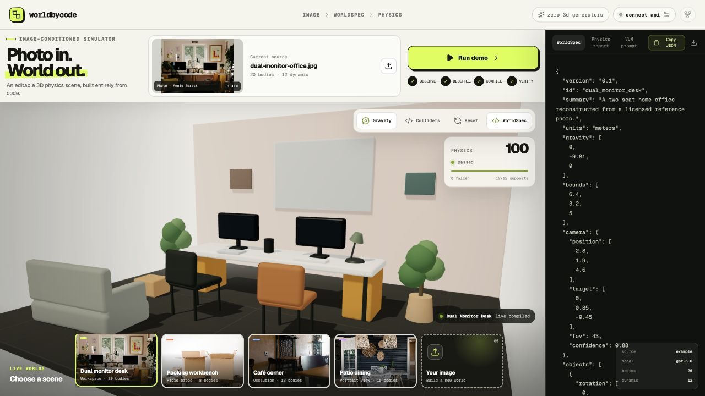
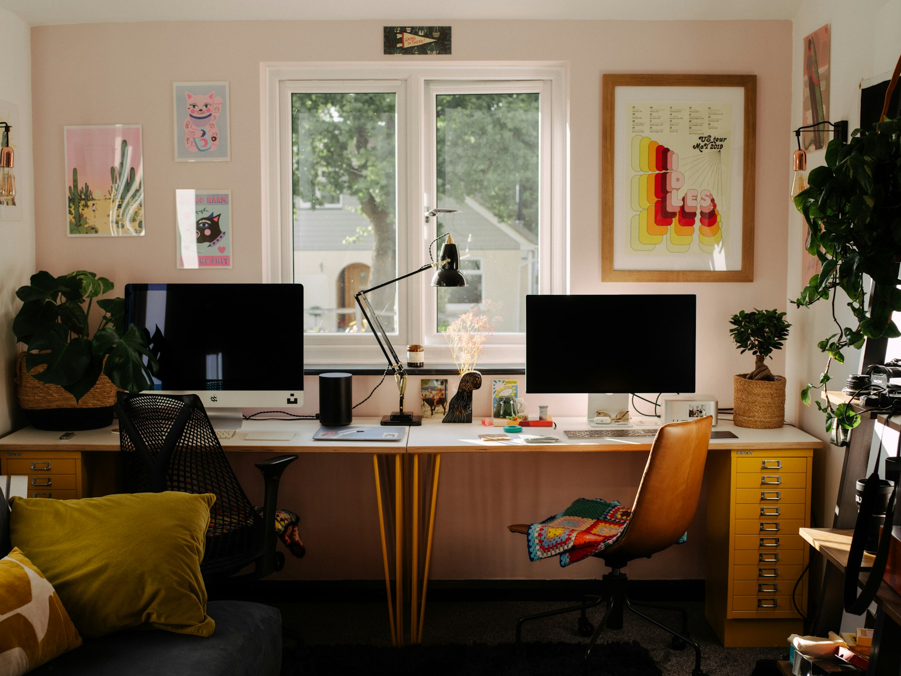
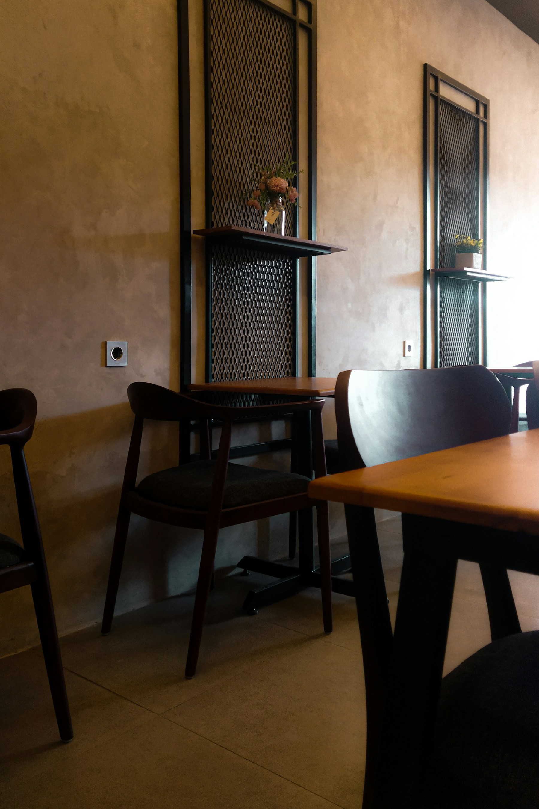
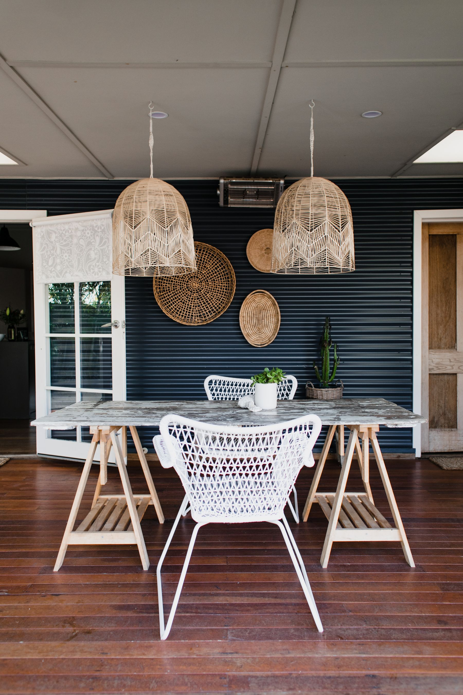
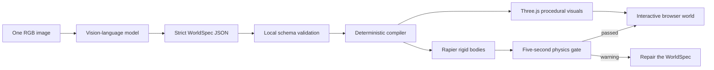

<div align="center">

# WorldByCode

### Photo in. World out.

**One RGB image → one editable, inspectable physics world.**

A vision-language model writes the scene specification.<br>
Deterministic code builds the geometry, colliders, and physics.

[](https://github.com/alvin528/WorldByCode/stargazers)
[](LICENSE)
[](https://nextjs.org/)
[](https://threejs.org/)
[](https://rapier.rs/)
[](#how-it-works)

[See the studio](#live-studio) · [Explore examples](#showcase) · [How it works](#how-it-works) · [Quick start](#quick-start) · [WorldSpec](#worldspec)

</div>



<p align="center">
  <sub>One workspace: source image, compiled world, live physics gate, and copyable WorldSpec.</sub>
</p>

WorldByCode converts a single image into a compact `WorldSpec`: named objects,
metric dimensions, support relations, materials, rigid-body types, masses,
confidence, and uncertainty. React Three Fiber compiles that specification into
procedural geometry, while Rapier builds and tests the physics world in the
browser.

The primary output is a **small, readable program for a world**, not a baked
mesh. You can inspect it, copy it, diff it, edit it, download it, or compile it
into another simulator.

> [!IMPORTANT]
> WorldByCode does not call an image-to-3D, text-to-3D, NeRF, Gaussian Splatting,
> or mesh-generation model. The VLM returns strict JSON only.

## At a glance

| | |
|---|---|
| **Input** | One RGB image |
| **Model output** | Strict, schema-validated WorldSpec JSON |
| **Geometry** | Trusted procedural Three.js components |
| **Physics** | Rapier rigid bodies, colliders, gravity, and live verification |
| **Interaction** | Drag objects, reset, inspect colliders, edit or copy JSON |
| **3D generation models** | None |

## Why WorldByCode?

Most image-to-3D systems optimize for a visually convincing asset. WorldByCode
optimizes for a usable world.

| | Conventional image-to-3D | WorldByCode |
|---|---|---|
| Primary output | Mesh or radiance field | Semantic `WorldSpec` |
| Geometry | Generated and opaque | Procedural and inspectable |
| Object identity | Often merged into one asset | Named objects with stable ids |
| Physics | Added later | Body, mass, collider, and support are first-class |
| Editing | Mesh-level operations | Change JSON or procedural parameters |
| Verification | Visual quality | Live settling, support, overlap, and fall checks |
| Portability | Asset formats | Small JSON contract plus deterministic compiler |

This makes the output useful for rapid scene prototyping, robotics simulation,
synthetic-data research, spatial-reasoning experiments, and simulator export.

## Live studio

The studio keeps the evidence in one place:

- a large source image for direct visual comparison;
- the compiled Three.js world, with movable furniture and props;
- a live physics score derived from the running Rapier simulation;
- the complete WorldSpec, ready to copy or download;
- the exact VLM prompt, model metadata, confidence, and uncertainty;
- four verified examples that work without an API key.

Run it locally:

```bash
npm install
npm run dev
```

Then open [`http://localhost:3000/demo`](http://localhost:3000/demo).

## Showcase

Every included example is backed by a licensed photograph and passes the live
five-second physics gate.

| Workspace | Packing workbench |
|---|---|
|  |  |
| **20 bodies · 12 dynamic · 100 physics** | **8 bodies · 5 dynamic · 100 physics** |

| Café corner | Patio dining |
|---|---|
|  |  |
| **13 bodies · 7 dynamic · 100 physics** | **15 bodies · 5 dynamic · 100 physics** |

The examples cover cluttered workspaces, small rigid props, occlusion, portrait
images, movable furniture, and supported tabletop objects.

## How it works



The model is deliberately constrained:

1. **See** — infer visible objects, scale cues, occlusion, camera, and support.
2. **Specify** — return schema-conforming JSON with confidence and uncertainty.
3. **Validate** — reject unknown kinds, invalid dimensions, broken support ids,
   unsafe masses, and malformed materials.
4. **Compile** — build known procedural visuals and colliders. The model never
   writes or executes JavaScript.
5. **Verify** — measure settling, falls, support geometry, and initial AABB
   overlap from the running Rapier scene.

## What works today

- OpenAI Responses API image-to-WorldSpec route.
- Strict Structured Outputs plus a second local validator.
- Server-key and temporary browser-session API modes.
- Procedural boxes, cylinders, tables, chairs, monitors, plants, lamps, sofas,
  bottles, cartons, and bags.
- Composite visuals and colliders for furniture and semantic objects.
- Fixed architecture with movable everyday furniture and props.
- Source image, interactive 3D world, WorldSpec, verifier report, and prompt in
  one workspace.
- Four zero-key examples with source attribution.
- Runtime gravity, drag interaction, reset, collider inspection, and JSON
  download.
- Static support and initial-overlap preflight.
- Live settle-time and fallen-body checks.

## Quick start

Requirements: Node.js 22.13 or newer.

```bash
git clone https://github.com/alvin528/WorldByCode.git
cd WorldByCode
npm install
cp .env.example .env.local
npm run dev
```

Open:

- homepage: `http://localhost:3000`
- live studio: `http://localhost:3000/demo`

The four included worlds work immediately without an API key. Click an example,
drag a chair or prop, then select **Run demo** to repeat the physics gate.

To generate a new world from an uploaded image, add:

```dotenv
OPENAI_API_KEY=your_server_side_key
OPENAI_WORLD_MODEL=gpt-5.6
```

You can also open **Connect API** in the studio and enter a temporary key. The
key stays in `sessionStorage`, is sent only to the same-origin `/api/world`
proxy, and is removed with the browser-tab session or **Clear session key**.

Run the quality checks with:

```bash
npm test
npm run lint
```

No database, GPU runtime, model weights, Blender, or local 3D generator is
required.

## Model and prompt

The default model is `gpt-5.6`, the quality-first alias used for spatial
reasoning and strict schema output. Set `OPENAI_WORLD_MODEL=gpt-5.6-terra` when
latency and cost matter more.

The request uses:

- the input image at `original` detail;
- medium reasoning effort;
- strict `text.format` JSON Schema output;
- `store: false`;
- the versioned prompt in [`lib/world-prompt.ts`](lib/world-prompt.ts);
- the schema and local validator in [`lib/worldspec.ts`](lib/worldspec.ts).

The prompt, schema, model name, token usage, compiler, and verification report
are visible. The system is meant to be inspectable end to end.

## WorldSpec

```json
{
  "version": "0.1",
  "id": "cafe_corner",
  "units": "meters",
  "gravity": [0, -9.81, 0],
  "camera": {
    "position": [2.65, 1.86, 4.35],
    "target": [-0.08, 0.84, -0.28],
    "fov": 44,
    "confidence": 0.86
  },
  "objects": [
    {
      "id": "chair_right",
      "label": "foreground café chair",
      "kind": "chair",
      "size": [0.58, 0.96, 0.58],
      "position": [0.78, 0.48, 1.55],
      "rotation": [0, 0.03, 0],
      "body": "dynamic",
      "mass": 6.5,
      "support": "floor",
      "confidence": 0.91,
      "notes": "Placed in front of the table to match source occlusion."
    }
  ],
  "uncertainties": [
    "The foreground table is partly cropped by the source image."
  ],
  "refusal": null
}
```

Every object has:

- a stable id and human-readable label;
- one supported procedural kind;
- metric dimensions and a center transform;
- fixed or dynamic physics plus mass;
- compact PBR material values;
- an optional support-object id;
- confidence and notes.

The browser receives JSON only. The model never writes or executes TypeScript,
JavaScript, shaders, or arbitrary Three.js code.

## Physics gate

The number shown in the studio is computed, not hard-coded.

- **Settle time** comes from live rigid-body linear and angular velocity.
- **Fallen bodies** are measured from Rapier translations.
- **Support geometry** checks the declared parent and contact height.
- **Initial overlap** is a conservative AABB preflight and is labeled as such.

A world passes only when:

- the score is at least 85;
- all declared supports are valid;
- the initial AABB overlap count is zero;
- no dynamic body falls out of the world;
- the scene reaches a stable state.

This is a first engineering gate, not proof of real-world equivalence.

## Project structure

```text
app/
├── page.tsx              # public project homepage
├── demo/page.tsx         # full interactive studio
├── WorldStudio.tsx       # compiler UI, Three.js scene, Rapier runtime
└── api/world/route.ts    # OpenAI Responses API proxy
lib/
├── demo-worlds.ts        # licensed verified examples
├── physics-verifier.ts   # static support and overlap checks
├── world-prompt.ts       # versioned Real2Sim prompt
└── worldspec.ts          # contract, JSON Schema, local validation
public/
└── demo-*.jpg            # stable source references
```

## Current scope

Version 0.1 targets indoor tabletop and manipulation scenes with roughly 5–20
rigid objects.

It intentionally does not attempt:

- people or animals;
- deformable objects, cloth, or liquids;
- articulated mechanisms;
- photorealistic reconstruction;
- precise hidden geometry from one view;
- safety-critical physical parameters.

Single-view metric scale and occluded geometry are fundamentally ambiguous.
WorldSpec records uncertainty instead of hiding it.

## Roadmap

- [ ] Render-to-reference silhouette and keypoint metrics.
- [ ] Bounded JSON Patch repair from verifier failures.
- [ ] A public 20–50 image benchmark with outputs, latency, and token usage.
- [ ] MJCF, SDF, and USD export.
- [ ] Pick-and-place and navigation task-success evaluation.
- [ ] Domain randomization and synthetic-data capture.
- [ ] Multi-view refinement without introducing a 3D generation model.

## Contributing

Useful contributions include:

- new procedural object kinds and matching colliders;
- better single-view scale and camera estimation;
- reference-to-render metrics;
- simulator exporters;
- benchmark scenes with redistributable source images;
- failure cases with an explanation of the desired geometry.

Please keep the central constraint intact: the VLM may specify a world, but
only trusted deterministic code may compile and execute it.

## Demo photo credits

- Dual monitor desk — [Annie Spratt on Unsplash](https://unsplash.com/photos/a-desk-with-two-computer-monitors-and-a-chair-6pMI--IXV-8)
- Packing workbench — [Kaboompics.com on Pexels](https://www.pexels.com/photo/carton-boxes-and-stacked-books-on-table-4498124/)
- Café corner — [Zulfahmi Al Ridhawi on Unsplash](https://unsplash.com/photos/a-cozy-cafe-interior-with-tables-and-chairs-7ZTH7KsF8NY)
- Patio dining — [Rachel Claire on Pexels](https://www.pexels.com/photo/dining-table-with-chairs-in-home-interior-design-6123238/)

The first and third use the [Unsplash License](https://unsplash.com/license).
The second and fourth use the [Pexels License](https://www.pexels.com/license/).

## License

[MIT](LICENSE) © 2026 WorldByCode contributors.
