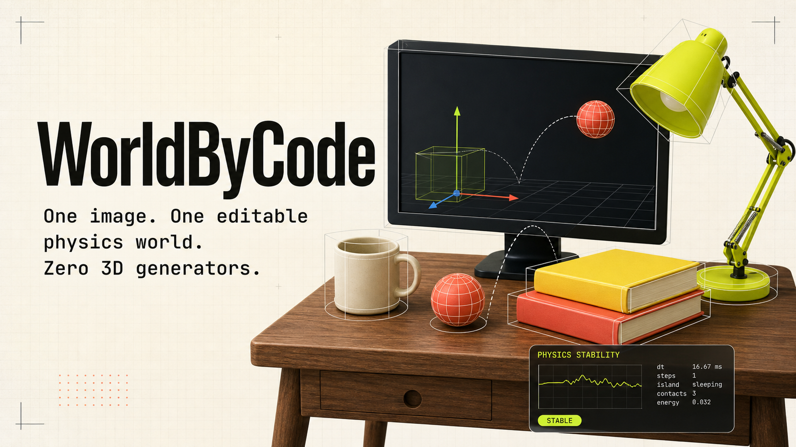

# WorldByCode



**One image. One editable physics world. Zero 3D generators.**

WorldByCode explores a deliberately constrained Real2Sim pipeline: a VLM reads
a reference image, an LLM writes a typed scene specification, and a deterministic
runtime turns that specification into an interactive physics world.

The core bet is that many useful robot-training scenes do not need a generated
mesh. They need the right objects, support relations, approximate dimensions,
collision shapes, materials, and physical behavior.

## What is working

- Interactive Three.js viewport with orbit controls.
- Rapier rigid-body simulation with gravity, reset, and collider inspection.
- Draggable dynamic objects for immediate physical testing.
- A constrained, downloadable `WorldSpec` representation.
- A staged `Observe → Blueprint → Build → Verify` product flow.
- Responsive studio interface and production-ready web build.

> **Alpha boundary:** image upload is currently a local preview and the pipeline
> runner is a deterministic mock. It does not yet send the image to a VLM or
> reconstruct a new scene. The executable desk scene proves the renderer,
> interaction model, physics loop, and product contract that the real VLM
> adapter will target.

## Why code instead of a 3D generator?

Generated geometry is visually expressive, but often difficult to edit,
simulate, or verify. WorldByCode asks a different question:

> Can a multimodal model infer a compact world program whose mistakes are
> measurable and repairable?

The output is not a baked asset. It is a scene program:

```json
{
  "scene": "desk_study_01",
  "units": "meters",
  "gravity": [0, -9.81, 0],
  "objects": [
    {
      "id": "mug",
      "primitive": "cylinder",
      "size": [0.16, 0.22, 0.16],
      "position": [0.72, 1.08, 0.08],
      "body": "dynamic",
      "collider": "cylinder",
      "mass": 0.34
    }
  ],
  "constraints": [
    { "type": "supported_by", "child": "mug", "parent": "desk" }
  ]
}
```

That makes the result editable, diffable, testable, and suitable for iterative
repair by an LLM.

## Architecture

```text
reference image
      │
      ▼
VLM observation graph
objects · camera · scale · relations
      │
      ▼
LLM constrained WorldSpec
primitives · transforms · materials · physics
      │
      ▼
deterministic compiler
Three.js scene + Rapier rigid bodies
      │
      ▼
physics verifier
stability · penetration · support · task affordance
      │
      └────────── repair feedback ──────────┐
                                           │
                                           └── back to the LLM
```

## Local development

Requirements: Node.js 22.13 or newer.

```bash
npm install
npm run dev
```

Then open `http://localhost:3000`.

Quality checks:

```bash
npm test
npm run lint
```

## Next milestones

1. Define and validate the full JSON Schema for `WorldSpec`.
2. Add a provider-agnostic VLM adapter that returns observation graphs only.
3. Compile boxes, cylinders, extrusions, lathed profiles, text, and simple CSG.
4. Estimate metric scale from priors and visible support objects.
5. Render the generated scene back into the reference camera.
6. Use image mismatch and physics failures as structured repair signals.
7. Publish a benchmark covering reconstruction, stability, and editability.

## Research metrics

- **Semantic coverage:** fraction of task-relevant objects represented.
- **2D alignment:** mask, box, keypoint, and depth-order agreement.
- **Physical validity:** penetration, support, settling, and joint constraints.
- **Editability:** successful natural-language edits without topology repair.
- **Task utility:** downstream policy success in the reconstructed scene.

## License

[MIT](LICENSE)
